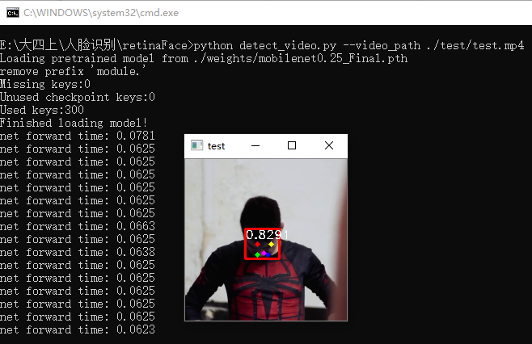
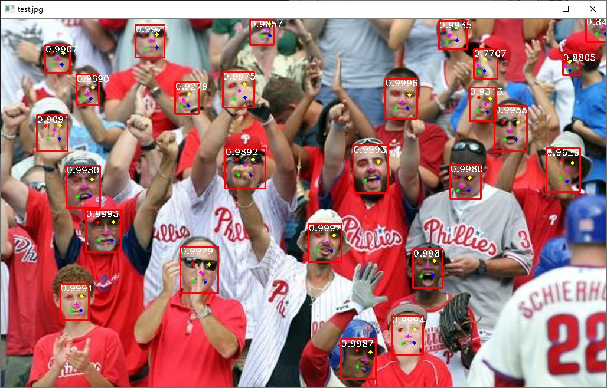

# retinaface-demo
mobilenet骨架的人脸检测及人脸关键点检测轻量级网络。win10直接运行bat批处理程序进行图片、视频、摄像头的人脸检测和人脸关键点检测

# requirements
* torch==1.2.0
* opencv-python==4.1.0.25
* numpy==1.18.1

# usage
* 图片 ```python detect.py --image_path test.jpg```
* 视频 ```python detect_video.py --video_path ./test/test.mp4```
* 摄像头 ```python detect_camera.py```

# preview


